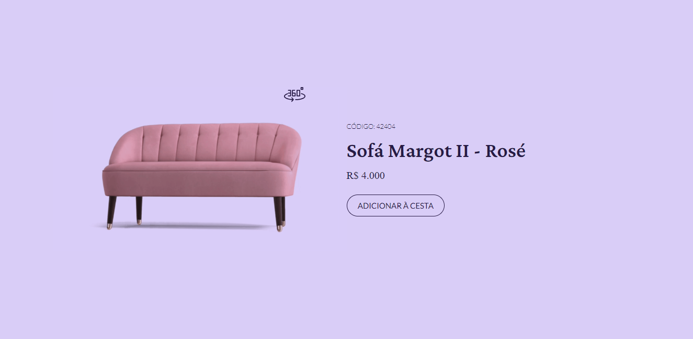

<h1 align="center"> Card de um produto #boracodar2</h1>

Card de um produtodesenvolvido em um evento promovido pela <a href="https://rocketseat.com.br">RocketSeat</a>  

  <a href="#-tecnologias">Tecnologias</a>&nbsp;&nbsp;&nbsp;|&nbsp;&nbsp;&nbsp;
  <a href="#-projeto">Projeto</a>&nbsp;&nbsp;&nbsp;|&nbsp;&nbsp;&nbsp;
  <a href="#-layout">Layout</a>&nbsp;&nbsp;&nbsp;|&nbsp;&nbsp;&nbsp;

 

  

## 🚀 Tecnologias

Esse projeto foi desenvolvido com as seguintes tecnologias:

- HTML e CSS
- JavaScript
- Git e Github
- Figma

## 💻 Projeto

Card de venda de um sofá

- [Acesse o projeto finalizado, online clicando aqui](https://carlimaraujo.github.io/productCard/)

## 🔖 Layout

Você pode visualizar o layout do projeto através [DESSE LINK](https://www.figma.com/community/file/1195050984449538256). É necessário ter conta no [Figma](https://figma.com) para acessá-lo.